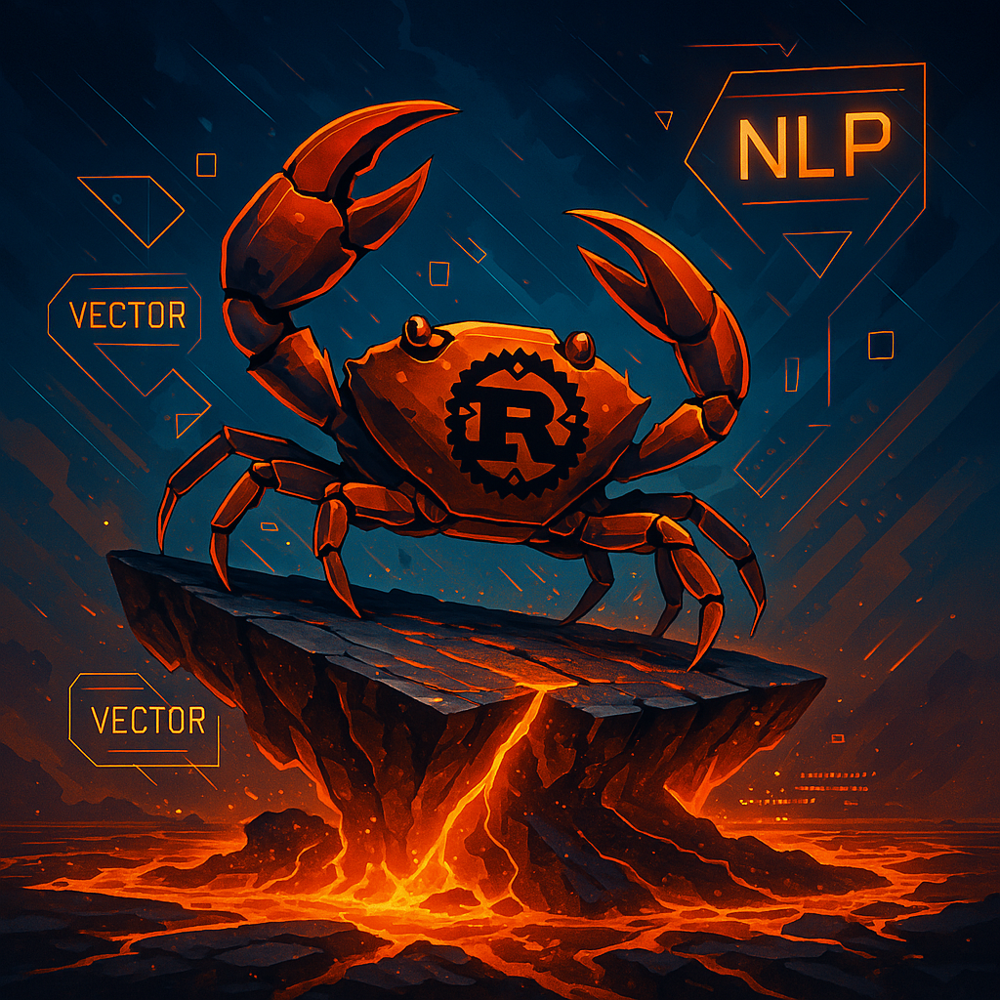

<p align="center">
  
</p>
<h1 align="center"> 
  Tictonix 
</h1>

[Russian version](https://github.com/Ave-Sergeev/Tictonix/blob/main/README.ru.md)

### Description

This crate provides functionality for working with vector representations of words (embeddings) and positional encoding.
It is intended for use in NLP tasks, deep learning, and your custom projects.

Also, this project is the second step (step 1 [tokenizer](https://github.com/Ave-Sergeev/Tokenomicon)) towards
own implementation of `LLM` on `Transformer` architecture.

### Provided functionality:

- Structure of Embeddings

1) Creating a new embedding matrix by various methods such as: `Gaussian`, `Xavier`, `Uniform`.
2) Constructing the resulting embedding matrix for an array of tokens (indices), and obtaining a specific embedding for a token (index).
3) Updating (replacing) the embedding for a particular token (index).

- Structure of PositionalEncoding

1) Creating a new positional encoding matrix by various methods such as: `Sinusoidal PE`, `Relative PE`, `Rotary PE`.
2) Applying positional encodings to the embedding matrix.
3) Returning a part of the positional encoding matrix for a sequence, and a particular positional encoding by its position.

- Structure of MatrixIO

1) Saving to a file, and retrieving the embedding matrix from the file. Available formats are .safetensors and .npy.

UPD: Important clarification.
In this implementation, the embedding matrix has columns corresponding to tokens (each column is an embedding for one token).

### Installing

Add to your `Cargo.toml`:
```toml
[dependencies]
tictonix = "0.8.0"
```

### Usage

See [examples for usage](https://github.com/Ave-Sergeev/Tictonix/blob/main/example/src/main.rs).

### Documentation

See [documentation](https://docs.rs/tictonix/0.8.0/tictonix/) for the project.

### Glossary

- Tokenization is the process of breaking text into separate elements called tokens.
  Tokens can be words, characters, sub-words, or other units, depending on the chosen tokenization method.
  This process is an important step in text preprocessing for Natural Language Processing (NLP) tasks.
- LLMs (large language models) are large language models based on deep learning architectures (e.g.,
  Transformer) that are trained on huge amounts of textual data. They are designed to perform a wide
  range of tasks related to natural language processing, such as text generation, translation, question answering,
  classification, and others. LLMs are capable of generalizing knowledge and performing tasks on which they have not
  been explicitly trained (zero-shot or few-shot learning).
- Transformer is a neural network architecture proposed in 2017 that uses the attention mechanism to process sequences
  of data such as text.
  The main advantage of Transformer is its ability to process long sequences and take context into account regardless of
  the distance between elements of the sequence.
  This architecture is the basis for most modern LLMs (such as GPT, BERT and others).
- Embedding is a numerical (vector) representation of text data (tokens, words, phrases or sentences).
- Positional Encoding is a technique used in the Transformer architecture to convey information about the order of
  elements in a sequence. Since Transformer has no built-in order information (unlike recurrent networks),
  positional encoding adds special signals to token embeddings that depend on their position in the sequence.
  sequence. This allows the model to take into account the order of words or other elements in the input data.

### P.S.

Don't forget to leave a ⭐ if you found [this project](https://github.com/Ave-Sergeev/Tictonix) useful.
